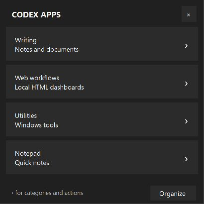

# Codex Apps

A small, configurable Windows taskbar launcher. Click its pinned icon to open
a menu above it. Open apps, documents, HTML pages, and folders from cascading categories.



Codex Apps is a standalone community utility. It does not require Codex, an
OpenAI account, an API key, or a network connection, and is not an official
OpenAI product.

## Features

- Centers its drop-up over its actual taskbar button.
- Follows Windows system light/dark mode, accent colors, and high-contrast colors.
- No decorative accent stripe at the top.
- Mixes individual apps and nested categories in the same menu.
- Includes a visual organizer for creating categories and dragging apps into them.
- Scrolls long lists and supports keyboard navigation.
- Accepts files of any type, folders, executable and shortcut paths, environment variables,
  relative paths, arguments, and working directories.
- Keeps the taskbar entry alive when dismissed, so right-click menus work.
- Loads saved configuration changes on the next activation, without rebuilding.

## Install

Download `CodexApps-0.3.1-win-x64.zip` from the GitHub Releases page, or build
from source below.

1. Extract the entire ZIP into a permanent folder you can write to. Do not run
   directly inside the ZIP. Keep `apps.json` beside `Codex Apps.exe`.
2. Open `Codex Apps.exe`.
3. Right-click its taskbar button and choose **Pin to taskbar**.
4. Click **Organize** to arrange your own applications and categories.
   **Save changes** updates your private `apps.local.json` and refreshes the menu.

## Organize visually

1. Click **Organize** in the launcher.
2. Select **All apps** or a category, then choose **New category** and name it.
3. Drag an app onto that category to put it inside. Drag it onto another app to
   place it before that app. Categories can contain subcategories. Select a
   category before adding a new app or subcategory to place it there directly.
4. To add a resource, choose **Add files...** and pick any existing file, such as
   an `.html`, `.pdf`, `.docx`, `.exe`, or `.lnk` file. You can also drag files or
   folders from File Explorer into the organizer.
5. Use **Edit...** for names, descriptions, paths, arguments, and launch behavior.
   **Move to...** and **Move up/down** work without dragging.
6. Click **Save changes**. **Cancel** discards the draft; removing an entry from
   the organizer never uninstalls its application.

An empty category is allowed while you are arranging the menu. The organizer
checks the complete layout before saving. If the JSON file changes outside the
organizer while it is open, it asks you to reopen instead of overwriting edits.

The included example uses Windows tools; no author's applications or paths are
included. Your configured applications must already be installed. Windows may
show its normal warning for an unsigned executable; users can instead build
the inspectable source themselves.

Windows 11 x64 with its installed .NET Framework 4.8 is the tested target.
Windows 10 x64 has the required APIs but is not part of the verified desktop
matrix. ARM64 native builds, top/side taskbars, and replacement taskbars are
not currently supported. No administrator access is required.

## Configure apps and categories

The organizer writes `apps.local.json`, which overrides `apps.json` when present. It is ignored by Git and
excluded from both release archives. Publish your generic defaults in
`apps.json`; keep computer-specific configuration in `apps.local.json`.

The configuration is a JSON array. A resource has a `path`. A category has `items`
instead of a path. Categories can contain apps and further categories:

```json
[
  {
    "name": "Notepad",
    "description": "Quick notes",
    "path": "%WINDIR%\\System32\\notepad.exe"
  },
  {
    "name": "Workflow dashboard",
    "path": "%USERPROFILE%\\Documents\\Workflow\\index.html"
  },
  {
    "name": "Audio",
    "description": "My audio applications",
    "items": [
      {
        "name": "Audio editor",
        "path": "Apps\\AudioEditor\\Editor.exe"
      },
      {
        "name": "Utilities",
        "items": [
          {
            "name": "My utility",
            "path": "%LOCALAPPDATA%\\MyUtility\\Utility.exe",
            "arguments": "--dashboard",
            "reuseExisting": false
          }
        ]
      }
    ]
  }
]
```

Replace example paths with your own files and installed applications. Relative paths are
resolved from the configuration file's folder, not from the shell's current
directory. JSON backslashes must be doubled; forward slashes also work in paths.
Environment variables such as `%WINDIR%`, `%LOCALAPPDATA%`, `%APPDATA%`,
`%USERPROFILE%`, and `%ProgramFiles%` are expanded when loading paths.

| Field | Applies to | Meaning |
| --- | --- | --- |
| `name` | Both | Required menu label, up to 80 characters |
| `description` | Both | Optional helper text, up to 160 characters |
| `items` | Category | Array of child apps/categories; can be empty while organizing |
| `path` | Resource | Required path to any existing file or folder when opened |
| `arguments` | App | Optional argument string passed as written |
| `workingDirectory` | Resource | Optional path; defaults to the resource's folder |
| `reuseExisting` | Executable | Focus a matching running executable; defaults to true without arguments, false with arguments |
| `windowTitle` | Executable | Optional exact title for finding a hidden/tray window |

HTML files open in the default browser. Other documents, shortcuts, and folders
open through their Windows file association. Arguments are not environment-expanded
and must quote file arguments as required by the target application. Shortcuts are
launched through Windows and are not deduplicated. A running app without an accessible window shows a useful message
instead of starting a second copy. Set `reuseExisting` to false if the app should
always receive a new launch request.

Limits: 500 total nodes and eight category levels. Invalid edits display an error
and preserve the current menu. A missing app does not prevent other entries from
loading; its opening attempt shows the path to fix. `apps.schema.json` is provided for
editors that support JSON Schema. Only use app configurations you trust: entries
launch local programs with the supplied arguments.

## Navigation

- Click an app name to launch it. Its root-level arrow opens app/folder actions.
- Click a category or its arrow to open the category. Hover a nested category
  to expand it; click a nested app to launch it.
- Tab moves between root buttons. Enter/Space activates a button. Right Arrow
  opens its submenu. Native menu arrow keys navigate categories.
- Escape backs out of a submenu, or dismisses the root. Clicking outside also
  minimizes the launcher. Click the taskbar icon to restore it.
- The X button or Windows **Close window** command exits it.

## Build and test

Use Windows PowerShell 5.1 from this folder. No package restore or SDK download
is needed; the build uses Windows' .NET Framework C# compiler.

```powershell
powershell.exe -NoProfile -ExecutionPolicy Bypass -File .\build.ps1
$test = Start-Process '.\Codex Apps.exe' -ArgumentList '--self-test' -Wait -PassThru
Get-Content .\test-results.txt
if ($test.ExitCode -ne 0) { throw 'Tests failed' }
```

Close the running launcher before overwriting its executable, or use
`build.ps1 -OutputName 'Codex Apps.next.exe'` to stage a build.

Create source and portable release archives:

```powershell
powershell.exe -NoProfile -ExecutionPolicy Bypass -File .\package.ps1
```

The packager builds and tests a separate executable, then includes only explicit
public files. It never includes `apps.local.json`, logs, diagnostic output, or
other workspace projects. Outputs are in `releases/`. GitHub Actions builds,
tests, and uploads the same ZIPs; it does not publish releases automatically.

## Source layout

| Module | Responsibility |
| --- | --- |
| `Program.cs` | Startup and single-instance lifetime |
| `Configuration.cs` | App/category model, path resolution, validation, editing |
| `Applications.cs` | Launching and focusing existing apps |
| `Launcher.cs` | Root interface, recursive menus, reload, dismissal |
| `Organizer.cs` | Visual editor, drag and drop, category moves, safe saves |
| `DesktopIntegration.cs` | Taskbar accessibility geometry and Windows theme |
| `Native.cs` | Small Win32 interoperability surface |
| `Placement.cs` / `MenuColors.cs` | Placement calculations and menu palette |
| `Tests.cs` / `OrganizerTests.cs` | Independent fixtures and behavior checks |

The acceptance contract is in `SPEC.md`. Tests use synthetic app fixtures and
do not require the original author's software or audio devices.

## Notes and troubleshooting

- If the icon is rearranged, restore the launcher to refresh its position.
  Explorer accessibility lookup runs in the background. If Explorer is restarting
  or cannot expose the button, the menu keeps its last anchor or temporarily uses
  the primary taskbar's center. Taskbar overflow and custom shells may prevent
  exact icon discovery.
- Windows' **system** theme is followed, matching the taskbar even when the
  separate application theme is different. Theme refresh does not modify Windows.
- `desktop-state.json` records local menu/icon geometry and theme for diagnostics.
  It is not included in Git or release packages. No telemetry is sent.
- Portable binaries are unsigned. No installer, background service, startup
  registration, or registry changes are performed.

## License

[MIT](LICENSE). Contributions are welcome; include a description of the behavior
and the Windows version/display scaling used for UI changes.
